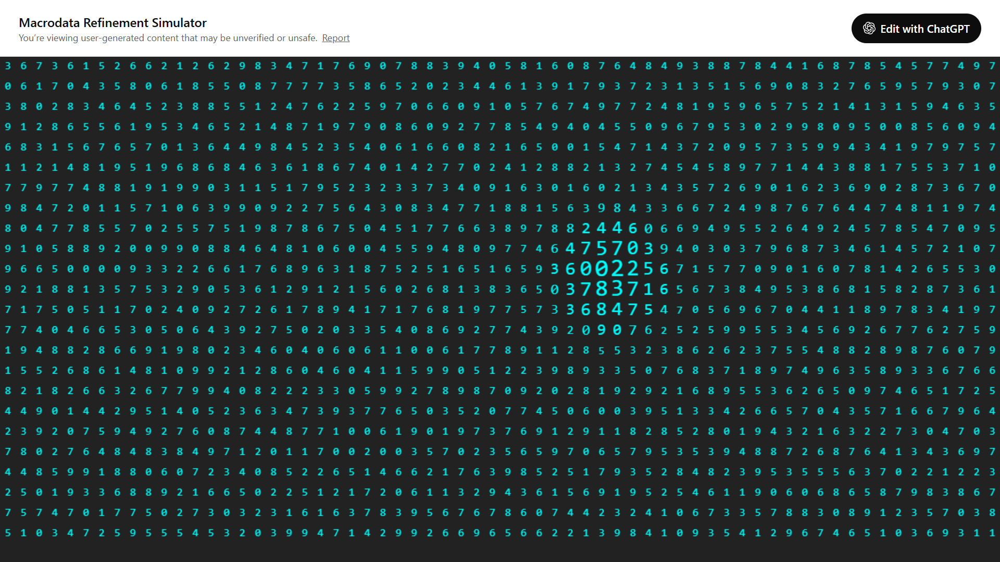
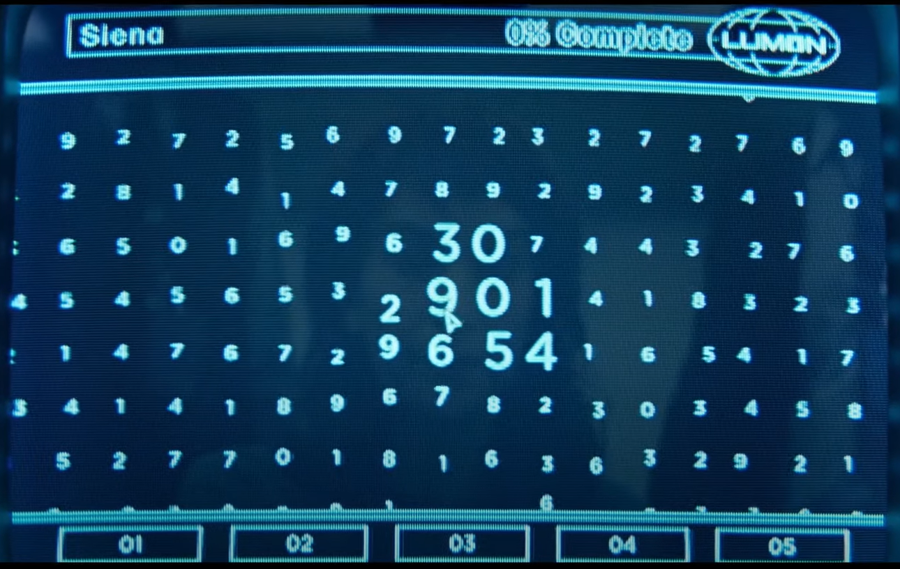

# Macro Data Refinement

First version with ChatGPT Canvas:

*Prompt:*

    Implement the macrodata refinement simulator (from the tv show severance) with web tech
    Render a grid of random digits on a very dark gray background.
    When you move your mouse over the canvas; digits within a radius around the cursor scale up.
    Each digit is spaced so that it forms a rectangular matrix of presumably equal-width columns and rows.
    Toward the middle-right, you can see digits in a slightly larger size (the pointer/cursor is near them). For example, near the cursor, you see digits like 2, 8, 1, 9, 1, 3, etc., somewhat enlarged relative to others. This presumably illustrates the “scale up” effect mentioned in the instructions.
    The digits in the grid appear randomly distributed, for example:
    In the top row, I can see (from left to right) something like 2 9 5 3 8 4 7 7 8 1 8 2 … and so on, continuing across.
    Many rows of similarly random digits, e.g. 5 1 2 3 7 5 … or 9 6 1 9 4 3 … etc.

https://chatgpt.com/canvas/shared/67a7f48c1d608191927c5a9fa49f9a09

## Resources

https://x.com/OpenAIDevs/status/1882876844208472339

